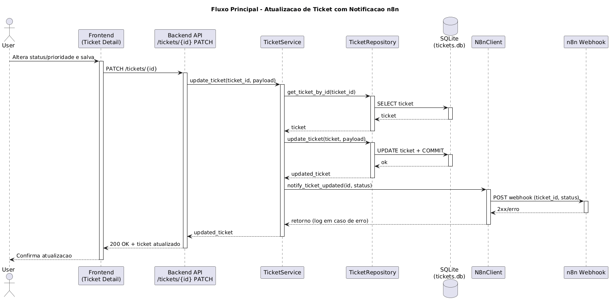
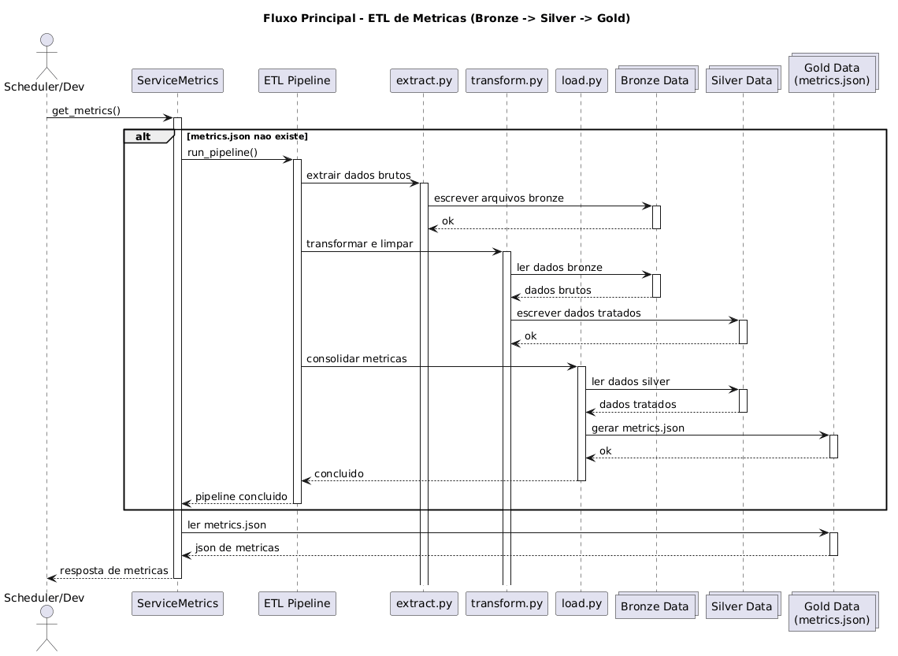
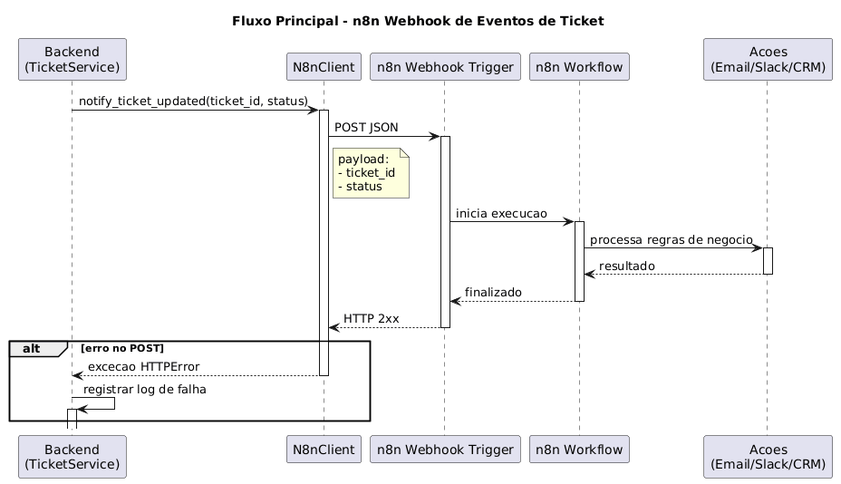
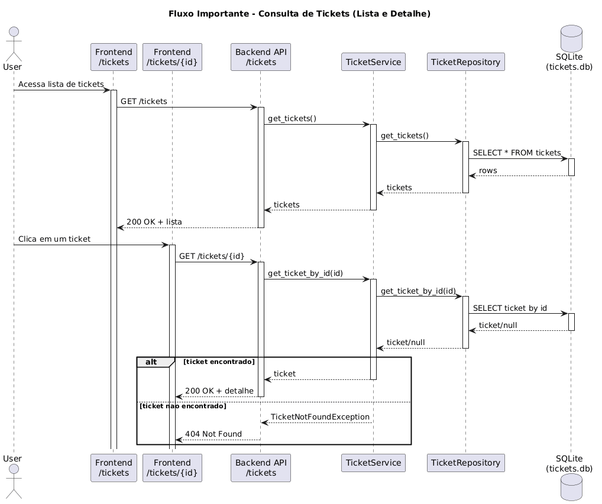
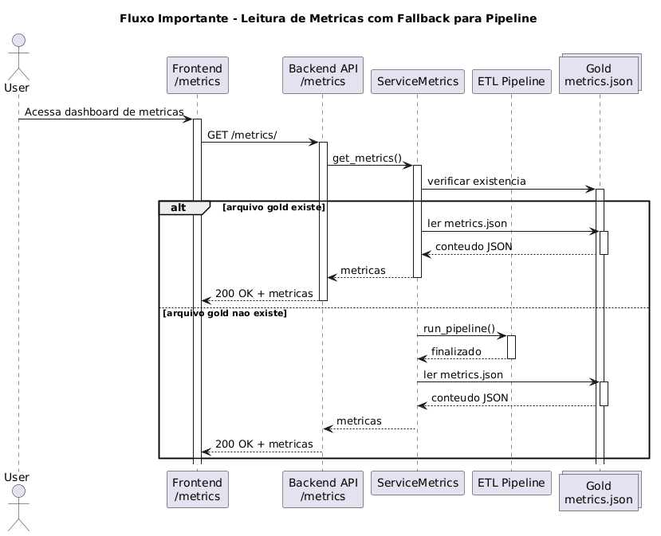
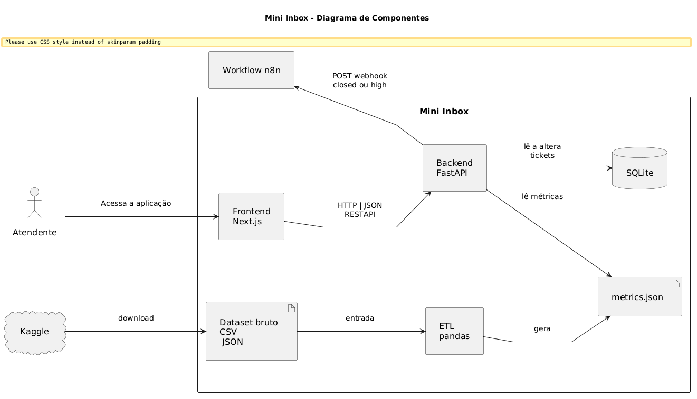
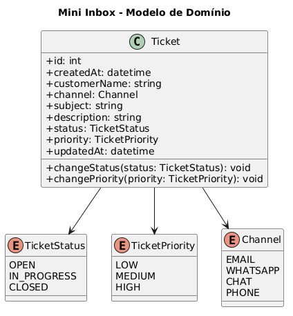
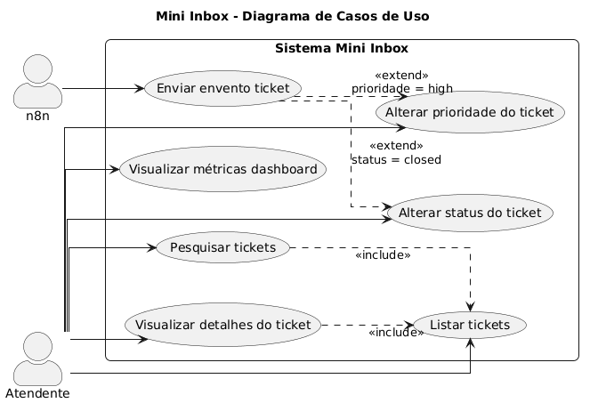
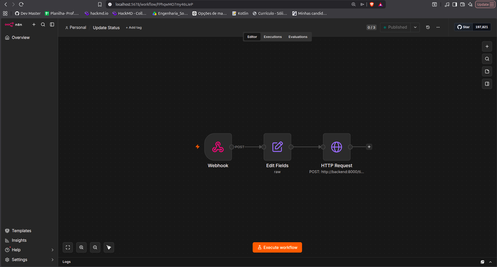

# Documentacao - Mini Inbox

Este diretorio concentra os artefatos de documentacao do projeto (diagramas e imagens de referencia).

## Estrutura

- `docs/diagrams/source/`: diagramas de arquitetura e dominio em PlantUML.
- `docs/diagrams/sequencies/`: fluxos de sequencia principais do sistema.
- `docs/diagrams/png/`: versoes renderizadas em PNG dos diagramas.
- `docs/images/`: imagens e screenshots de suporte.

## Atualizar Imagens dos Diagramas

Para atualizar todos os PNGs a partir dos arquivos `.puml`, rode na raiz do projeto:

```bash
docker run --rm -v "$PWD/docs/diagrams:/work" -w /work plantuml/plantuml -tpng source/*.puml sequencies/*.puml && mkdir -p docs/diagrams/png && cp docs/diagrams/source/*.png docs/diagrams/png/ && cp docs/diagrams/sequencies/*.png docs/diagrams/png/
```

## Diagramas Renderizados (PNG)

### Sequencia

- [01 - Ticket update + n8n](diagrams/png/01-ticket-update-n8n.png)



- [02 - ETL metrics pipeline](diagrams/png/02-etl-metrics-pipeline.png)



- [03 - n8n webhook principal](diagrams/png/03-n8n-webhook-main.png)



- [04 - Tickets list/detail](diagrams/png/04-tickets-list-and-detail.png)



- [05 - Metrics read/build](diagrams/png/05-metrics-read-or-build.png)



### Arquitetura e Dominio

- [Components](diagrams/png/components.png)



- [Domain Model](diagrams/png/domain-model.png)



- [Use Case](diagrams/png/use-case.png)



## Diagramas de Sequencia (PlantUML)

- [Indice dos diagramas](diagrams/sequencies/list.puml)
- [01 - Ticket update + n8n](diagrams/sequencies/01-ticket-update-n8n.puml)
- [02 - ETL metrics pipeline](diagrams/sequencies/02-etl-metrics-pipeline.puml)
- [03 - n8n webhook principal](diagrams/sequencies/03-n8n-webhook-main.puml)
- [04 - Tickets list/detail](diagrams/sequencies/04-tickets-list-and-detail.puml)
- [05 - Metrics read/build](diagrams/sequencies/05-metrics-read-or-build.puml)

## Diagramas de Arquitetura/Dominio

- [Components](diagrams/source/components.puml)
- [Domain Model](diagrams/source/domain-model.puml)
- [Use Case](diagrams/source/use-case.puml)

## Workflow n8n

- Export oficial do workflow: [`workflow.json`](../workflow.json)
- Screenshot do workflow em execucao: [`images/n8n-workflow-update-status.png`](images/n8n-workflow-update-status.png)


